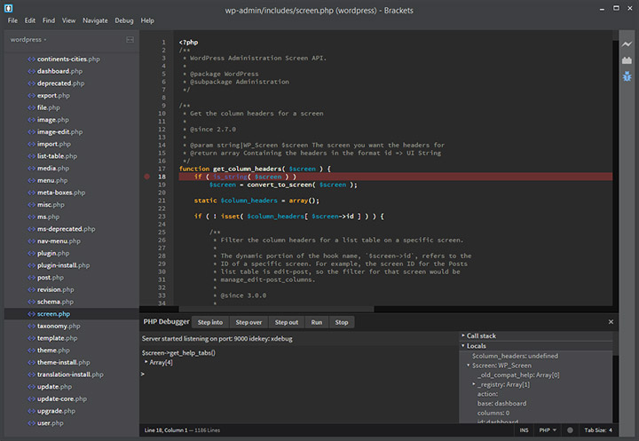

PHP Debugger for Brackets
-------------------------
This is a debugger for the PHP language currently using xdebug.

## Features
* Breakpoints
* Local variables
* Super globals
* Code evaulation in context

## Installation
1. Install [xdebug](http://www.xdebug.com/docs/install)
2. Configure xdebug with idekey and port number see example below
3. Install php-debugger in brackets.
4. Configure the idekey and port config options if you changed them from the default.

##### Example of xdebug config in php.ini
```
[xdebug]
zend_extension=<path to so/dll>
xdebug.idekey=idekey
xdebug.remote_enable=true
xdebug.remote_port=9000
```

## Usage
1. Open a PHP project in Brackets
2. Add a breakpoint to some file.
3. Fire up a browser and add ?XDEBUG_SESSION_START=xdebug to the end of the page you want to debug.
4. PHP Debugger should now halt on breakpoint.
5. Step using the UI buttons or shortcuts F10 and F11.

## Settings

##### php-debugger.port
Enables you to change the default to something custom.
```json
"php-debugger.port": 9001
```

##### php-debugger.idekey
Enables you to change the default idekey to something custom.
```json
"php-debugger.port": "xdebug"
```

##### php-debugger.debug
Enables you go get more verbose debugging output.
```json
"php-debugger.debug": true
```

## Screenshots

  
*Default view no active debugging session*

  
*Active debugging session showing local variables and some code evaluation*
